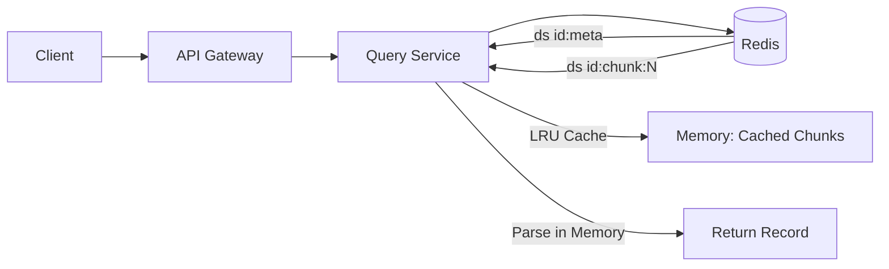

# 大规模结构化数据在 Redis 中的存储与查询方案演进

> **目标**：高效、可靠地支持 **1GB ~ 10GB 级别** 的文本文件（约 **1,000 万 ~ 2 亿条记录**），通过索引快速查询任意一条记录，同时兼顾性能、内存、运维复杂度和成本。

本文档系统梳理了我们在设计过程中**尝试的多种方案**，分析其优缺点，并最终确定**推荐架构**。适用于数据平台、日志分析、ID 映射等场景。

---

## 一、问题背景

- 原始数据：纯文本文件（如 CSV、JSONL、日志），以自定义分隔符进行分割. 本文档中为 `\n`
- 规模：1GB ~ 10GB，对应约 2x10⁶ ~ 10⁹ 条记录, 每条记录约 10bytes ~ 500bytes
- 查询模式：类似 `GET /datasets/{数据集id}/records/{数据索引}`（按逻辑行号随机访问）
- 约束：
    - 要求低延迟（理想 <50ms）
    - 希望避免引入外部存储（如 S3）——但可接受作为备选
    - Redis 是现有基础设施，希望优先利用

---

## 二、方案演进与评估

### 方案 1️⃣：单 Redis List 存储全部记录
**做法**：将整个文件拆分后，全部 `RPUSH` 到一个 List。

#### ❌ 问题：
- **大 Key 风险**：10GB → List 占用 >12GB 内存
- **阻塞主线程**：`LINDEX` 在尾部 O(N)，延迟不可控
- **持久化/主从同步卡顿**
- **Redis 官方明确不建议**

> **结论**：仅适用于 **<100MB** 小数据集，**1GB+ 完全不可行**。

---

### 方案 2️⃣：小粒度 Redis List 分片（每 32K 条一个 List）
**做法**：每 32,768 条记录存一个 List，共需约 `60 ~ 30,000` 个 Lists。

#### ⚠️ 优缺点：
| 优点                      | 缺点                                    |
| ------------------------- | --------------------------------------- |
| 单 List 小，无大 Key 风险 | **Key 数量爆炸**（10GB → 30,000+ Keys） |
| `LINDEX` 延迟稳定（<1ms） | 写入需批量操作，易出错                  |
| 纯 Redis，部署简单        | 内存开销仍高（≈原始数据大小）           |

> **结论**：适合 **≤2GB**，**10GB 可用但不优雅**。

---

### 方案 3️⃣：Redis String + 跳表索引（Sorted Set）
**做法**：
- `file:{id}`：存完整 10GB 文件为 String
- `index:{id}`：Sorted Set，`score=数据索引`, `member=偏移值`

#### ⚠️ 优缺点：
| 优点                              | 缺点                                 |
| --------------------------------- | ------------------------------------ |
| 查询极快（O(log N) + `GETRANGE`） | **String 本身是大 Key**（10GB）      |
| 无外部依赖                        | Redis 内存压力巨大, 写入数据是个挑战 |
| 实现简单                          | 持久化慢，运维风险高                 |

> **结论**：适合 **≤2GB** 场景，**10GB 不推荐**。

---

### 方案 4️⃣：混合架构（Redis + 对象存储）
**做法**：
- 数据存 S3/MinIO/RustFS, 相当于 方案 3️⃣ 的数据放在对象储存组件中
- Redis 仅存轻量元数据（<1KB）, 元数据表示数据索引对应数据的偏移值, 不是每个索引都存, 而是存一个跳表

#### ✅ 优缺点：
| 优点                          | 缺点                         |
| ----------------------------- | ---------------------------- |
| Redis 内存极低（<1MB/数据集） | 首次查询延迟较高（50~100ms） |
| 成本极低                      | 引入外部依赖                 |
| 天然支持 TB 级扩展            | 需维护对象存储               |

> **结论**：**10GB+ 最佳方案之一**，但若强制“纯 Redis”，则需另选。

---

### 方案 5️⃣（✅ 最终选择）：**4MB Redis String 分片 + 元数据索引 + 内存缓存**

#### 🔧 核心设计：
| 组件         | 说明                                                              |
| ------------ | ----------------------------------------------------------------- |
| **数据分片** | 将数据每约 4MB 分为一个 chunk, 一个索引数据不能同时存在多个分片中 |
| **元数据**   | 记录每个 chunk 的最后一条数据索引                                 |
| **查询流程** | 1. 加载元数据 → 2. 二分查找分片 → 3. 加载分片 → 4. 内存解析出数据 |
| **缓存优化** | Query Service 本地 LRU 缓存元数据和已加载的分片数据（4MB/块）     |
| **加载优化** | 根据请求的数据索引提前缓存下一个分片                              |
| **压缩存储** | 分片数据压缩后存 Redis，节省内存                                  |

#### ✅ 为什么选择它？

| 维度           | 表现                                                 |
| -------------- | ---------------------------------------------------- |
| **内存可控**   | Redis 占用 ≈ 原始数据大小（10GB → 10.5GB），无大 Key |
| **Key 数合理** | 10GB → ~2560 Keys（比方案 2️⃣ 减少 90%）               |
| **查询性能**   | 首次 20~50ms，**缓存命中后 0.1~1ms**                 |
| **无外部依赖** | 纯 Redis，符合“最小改动”原则                         |
| **工程可行**   | 实现简单，易于监控和运维                             |
| **扩展性**     | 支持多节点部署（hash tag 保证亲和性）                |

---

## 三、最终架构图

### 四、性能与资源估算（按最大评估 10GB / 10亿条）

| 指标                                   | 数值                                            |
| -------------------------------------- | ----------------------------------------------- |
| 分片数量                               | ~2,560                                          |
| 单分片大小                             | ≤4 MB                                           |
| Redis 内存                             | ~10.5 GB                                        |
| 元数据大小                             | ~100 KB                                         |
| 随机索引. 缓存未命中延迟(小概率)       | 20~50 ms                                        |
| 随机索引. 缓存命中延迟(极大概率)       | 0.1~1 ms                                        |
| 有序索引. 查询延迟. (提前缓存下一分片) | 0.1~1 ms                                        |
| 单 Query 实例缓存内存                  | 1 GB（缓存 100 个分片, 包含开发语言的数据结构） |

### 五、小场景数据储存

考虑小场景, 文件大小在 100M, 分割后数据量在 20W ~ 1000W 之间的方案对比.

| 方案                     | 实现                   | 内存          | 查询延迟 | Key 数 | 推荐度      |
| ------------------------ | ---------------------- | ------------- | -------- | ------ | ----------- |
| A. 单 Redis List         | 全部 RPUSH 到一个 List | ≈120MB        | <0.5ms   | 1      | ✅✅✅（首选） |
| B. 小分片 List（32K/片） | 每 32K 条一个 List     | ≈120MB        | <1ms     | 7~306  | ⚠️ 过度设计  |
| C. 4MB String + 元数据   | 按字节分片 + 解析      | ≈120MB	5~20ms | 25~30    | 25     | ⚠️ 过度设计  |

综合考虑, 选择使用**方案 A**, 有如下考虑.

将 **1000 万条（10⁷）记录** 放入 **单个 Redis List**，在大多数现代生产环境中 是可以接受的，但**需满足一定条件**。

- 主要操作为 `LINDEX`（随机读）或 `RPUSH`（追加写）. (当前业务满足)
- 没有`LREM`/`LSET`/`LRANGE`操作. (当前业务满足)
- 尽量使用 pipeline 批量写入. (当前业务满足)
- 使用 `UNLINK` 命令惰性删除list. (当前业务满足)
- **Redis 版本 ≥4.0**

为什么要求 **Redis 版本 ≥4.0**? 从该版本开始，Redis 引入了若干**关键特性与性能改进**, 这些对处理大 Key（如 1000 万条的 List）的**稳定性、内存效率和运维安全性**至关重要。以下是具体原因

- `UNLINK` 在该版本后可用
- List 内部结构优化（ziplist → quicklist）. Redis 3.2 引入 quicklist（但 4.0+ 更成熟）, 再3.2之前List 使用 ziplist（小）或 linkedlist（大），切换后内存膨胀严重。

当然 Redis 版本 ≥7.0 会更好一些, 其使用了 listpack 替代了 ziplist。其性能和内存优化更好一些。

### 六、结语

我们通过**系统性评估多种存储模型**，最终选择 “**4MB Redis String 分片 + 元数据索引 + 内存缓存**” 方案，因为它：

✅ 在 **纯 Redis 架构**下 实现了 **最佳平衡**
✅ 既避免了大 Key 风险，又控制了 Key 数量
✅ 通过极低成本的本地缓存机制，将查询性能提升百倍
✅ 工程实现简单，易于维护和扩展

在**小场景**的情况下**文件大小 <= 100M**. 优先采用**单 Redis List**方案, 但是注意要求**redis版本≥4.0**
