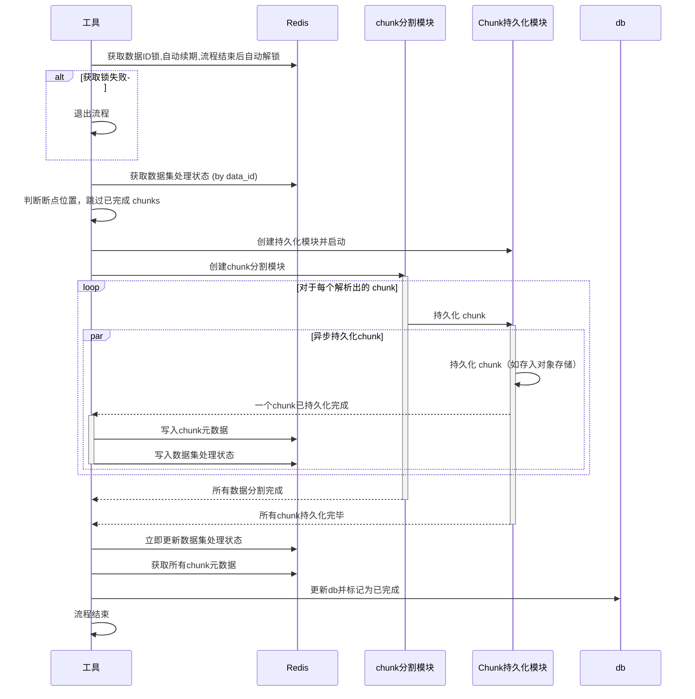

# 数据处理流程

```mermaid
sequenceDiagram
    participant a as 工具
    participant b as Redis
    participant c as chunk分割模块
    participant d as Chunk持久化模块
    participant e as db

    a->>b: 获取数据ID锁,自动续期,流程结束后自动解锁
    alt 获取锁失败
        a->>a: 退出流程
    end

    a->>b: 获取数据集处理状态 (by data_id)

    a->>a: 判断断点位置，跳过已完成 chunks
    a->>d: 创建持久化模块并启动
    a->>c: 创建chunk分割模块

    activate c

    loop 对于每个解析出的 chunk
        c->>d: 持久化 chunk
        activate d
        par 异步持久化chunk
        d->>d: 持久化 chunk（如存入对象存储）

        d-->>a: 一个chunk已持久化完成
        activate a
        a->>b: 写入chunk元数据
        a->>b: 写入数据集处理状态
        deactivate a

        end
    end

    c-->>a: 所有数据分割完成
    deactivate c

    d-->>a: 所有chunk持久化完毕
    deactivate d

    a->>b: 立即更新数据集处理状态

    a->>b: 获取所有chunk元数据

    a->>e: 更新db并标记为已完成

    a->>a: 流程结束
```

# 数据查询流程

# 恢复器
