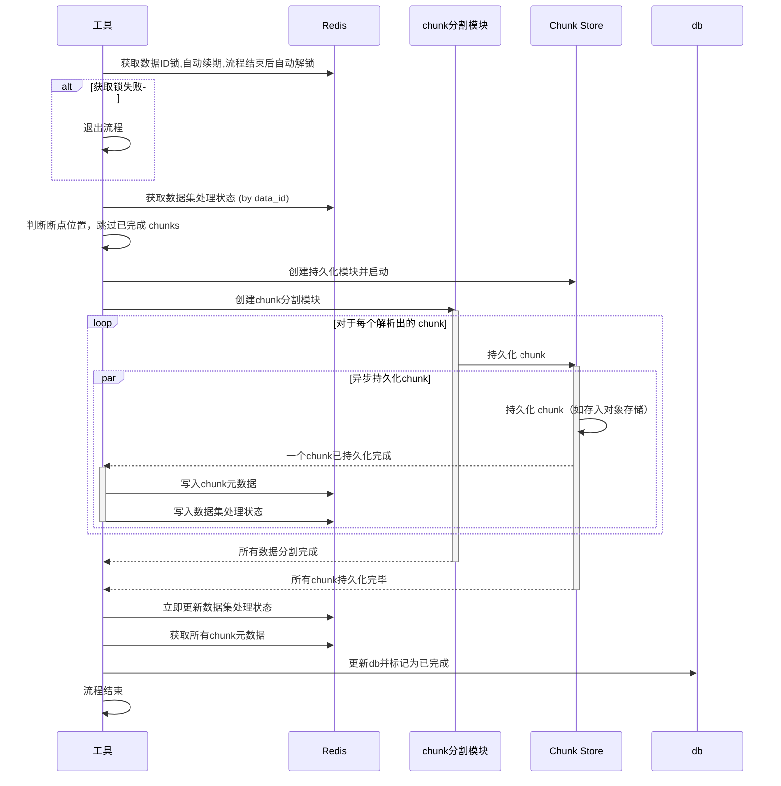
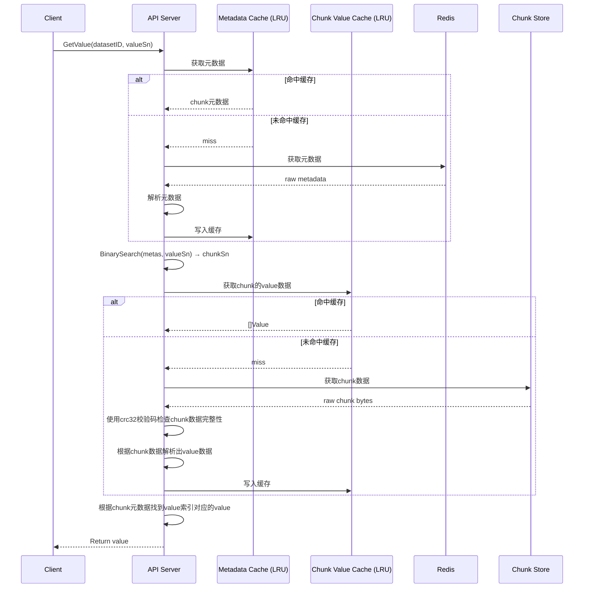

# 数据处理流程

```mermaid
sequenceDiagram
    participant a as 工具
    participant b as Redis
    participant c as chunk分割模块
    participant d as Chunk Store
    participant e as db

    a->>b: 获取数据ID锁,自动续期,流程结束后自动解锁
    alt 获取锁失败
        a->>a: 退出流程
    end

    a->>b: 获取数据集处理状态 (by data_id)

    a->>a: 判断断点位置，跳过已完成 chunks
    a->>d: 创建持久化模块并启动
    a->>c: 创建chunk分割模块

    activate c

    loop 对于每个解析出的 chunk
        c->>d: 持久化 chunk
        activate d
        par 异步持久化chunk
        d->>d: 持久化 chunk（如存入对象存储）

        d-->>a: 一个chunk已持久化完成
        activate a
        a->>b: 写入chunk元数据
        a->>b: 写入数据集处理状态
        deactivate a

        end
    end

    c-->>a: 所有数据分割完成
    deactivate c

    d-->>a: 所有chunk持久化完毕
    deactivate d

    a->>b: 立即更新数据集处理状态

    a->>b: 获取所有chunk元数据

    a->>e: 更新db并标记为已完成

    a->>a: 流程结束
```

# 数据查询流程

```mermaid
sequenceDiagram
    participant Client
    participant APIServer as API Server
    participant MetaCache as Metadata Cache (LRU)
    participant ChunkCache as Chunk Value Cache (LRU)
    participant Redis
    participant Chunk Store

    Client ->> APIServer: GetValue(datasetID, valueSn)
    %% Step 1: 加载元数据 (with cache)
    APIServer ->> MetaCache: 获取元数据
    alt 命中缓存
        MetaCache -->> APIServer: chunk元数据
    else 未命中缓存
        MetaCache -->> APIServer: miss
        APIServer ->> Redis: 获取元数据
        Redis -->> APIServer: raw metadata
        APIServer ->> APIServer: 解析元数据
        APIServer ->> MetaCache: 写入缓存
    end

    %% Step 2: 二分查找查找 chunk
    APIServer ->> APIServer: BinarySearch(metas, valueSn) → chunkSn

    %% Step 3: 加载chunk的value数据 (with cache)
    APIServer ->> ChunkCache: 获取chunk的value数据
    alt 命中缓存
        ChunkCache -->> APIServer: []Value
    else 未命中缓存
        ChunkCache -->> APIServer: miss
        APIServer ->> Chunk Store: 获取chunk数据
        Chunk Store -->> APIServer: raw chunk bytes
        APIServer ->> APIServer: 使用crc32校验码检查chunk数据完整性
        APIServer ->> APIServer: 根据chunk数据解析出value数据
        APIServer ->> ChunkCache: 写入缓存
    end

    %% Step 4: 找到目标value
    APIServer ->> APIServer: 根据chunk元数据找到value索引对应的value

    APIServer -->> Client: Return value
```

# 恢复器
